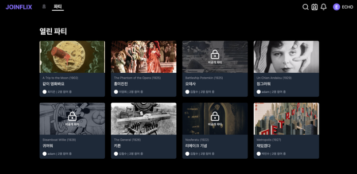

<h1>Joinflix (실시간 동기화 기반 OTT 소셜 파티 플랫폼)</h1>

## 📅 프로젝트 정보

- **진행 기간**: 2025.01.20 ~ 2025.02.28 (6주)
- **팀 구성**: 4명
- **핵심 타겟**: 영화 취향을 공유하고 함께 볼 사람을 찾는 사용자
- **주요 가치**: 실시간 상호작용 + 멤버십 기반 프리미엄 경험

---

# 🛠 기술 스택

## 🖥 Backend

     

## 🎨 Frontend

       

## ☁ DevOps & Infra

        

---

# 🌐 Production Deployment

- AWS EC2 기반 운영
- Docker Compose 컨테이너 환경
- Nginx Reverse Proxy
- Let's Encrypt SSL 적용
- HTTPS 전 구간 암호화

> 단순 개발 서버가 아닌, 실제 도메인 기반 운영 서비스입니다.

---

# 🔐 통합 인증 & 보안 설계

### ✔ 인증 구조

- AccessToken → 메모리 저장
- RefreshToken → HttpOnly + Secure 쿠키
- Refresh Token Rotation(RTR) 적용
- Redis 기반 토큰 관리
- Spring Security 필터 체인 커스터마이징

---

## 🔒 보안 제한 정책

| 구분        | 제한 항목          | 제한 수치  | 저장소 |
| ----------- | ------------------ | ---------- | ------ |
| 회원가입    | IP당 가입 제한     | 24시간 5회 | MySQL  |
| 이메일 인증 | 코드 유효시간      | 15분       | Redis  |
| 로그인      | 실패 시 잠금       | 1시간 5회  | MySQL  |
| 동시 접속   | 멤버십별 기기 제한 | 차등 적용  | Redis  |

---

## 🏗 Architecture

### 📌 Infrastructure Overview

- **AWS EC2 (Docker 기반 배포)**
- **Nginx Reverse Proxy (HTTPS / SSL)**
- **Spring Boot Backend**
- **React Frontend**
- **Redis (Cache & Sync State)**
- **Amazon RDS (MySQL)**
- **Amazon S3 (Image / Video Storage)**
- **GitHub Actions CI/CD 자동 배포**

### 📌 External APIs

- PortOne 결제 API
- SMTP Email Service

## 📸 Screenshots

### 🎉 Party Room

- 실시간 파티 참여 UI
- 공개 / 비공개 파티 구분
- 영화별 파티 목록 조회
- WebSocket 기반 실시간 상태 반영

---

# 👨‍💻 팀원 역할

## 🧑‍💻 [강연주] - 나의 역할 (Auth / Payment / DevOps)

### 🔹 인증 & 보안

- Spring Security 필터 체인 커스터마이징
- JWT + RTR 설계
- OAuth 2.0 (Kakao)

### 🔹 동시성 제어

- Redis 기반 세션 제어
- 멤버십별 최대 접속 기기 수 제한
- 초과 시 FIFO 방식 Kick-out
- 세션 무결성 유지
- 어뷰징 방지

### 🔹 결제

- PortOne API 연동
- 서버 측 사후 검증 (Cross Validation)
- 금액 위변조 방지
- 자동 환불 처리 로직 구현
- 멤버십 만료 Scheduler 배치 처리

### 🔹 CI/CD & Infra

- GitHub Actions 자동 배포 파이프라인 구축
- Docker 이미지 최적화
- Dev / Prod 환경 분리
- EC2 / RDS / S3 연동 및 도메인 HTTPS 설정

---

## 🧑‍💻 [김재우] – Review & Friend

### 🔹 이벤트 알림

- 친구 초대 / 수락 기능 구현
- SSE 기반 친구 초대 및 수락 실시간 알림 전송

### 🔹 영화 리뷰 시스템

- 영화별 별점 및 코멘트 작성 기능 구현
- 리뷰 좋아요 / 싫어요 상호작용 기능 개발
- 평균 평점 집계 로직 설계

---

## 🧑‍💻 [김유라] – Frontend & Chat

🔹 전체 UI/UX 설계 및 개발

- React + Vite 기반 SPA 구조 설계 및 전체 화면 구현
- 공통 Layout 및 라우팅 구조 설계 (Protected Route 포함)
- Zustand 기반 전역 상태 관리 구현
- Axios 인터셉터를 활용한 인증 토큰 자동 갱신 처리
- 반응형 UI 구현 및 사용자 경험(UX) 개선

### 🔹 실시간 음성 채팅

- WebRTC 기반 P2P 음성 통신 구현
- 시그널링 서버(STOMP) 연동 및 ICE Candidate 교환 처리
- 마이크 On/Off 제어 및 연결 상태 UI 구현

---

## 🧑‍💻 [최유림] – Party & Chat

### 🔹 실시간 채팅

- WebSocket + STOMP 기반 1:N 실시간 채팅 구현
- 파티원 단위 메시지 브로드캐스트 구조 설계

### 🔹 영상 동기화 시스템

- 재생/일시정지/탐색(Seek) 이벤트 실시간 전파
- 서버 기준 타임스탬프 기반 재생 위치 보정 로직 구현

### 🔹 호스트 권한 관리

- 파티장(Host) 중심 방 제어 구조 설계
- 호스트 퇴장 시 권한 위임 로직 구현
- 방 폭파 기능 및 전체 사용자 세션 정리 처리

---

# 📊 성과

- ✅ Redis 기반 멤버십 동시성 제어 설계
- ✅ RTR 적용으로 보안성 강화
- ✅ 실서비스 수준 결제 검증 시스템 구현
- ✅ 실제 도메인 운영 배포 완료
- ✅ 실시간 채팅 환경에서 세션 무결성 유지

---

# 🔮 Future Roadmap

- Blue/Green 무중단 배포
- Prometheus + Grafana 모니터링
- Kafka 기반 이벤트 아키텍처 확장

---

# 🎯 핵심 차별점

Joinflix는 단순 CRUD 프로젝트가 아닌,

✔ 인증  
✔ 결제  
✔ 동시 접속 제어  
✔ 실시간 채팅  
✔ DevOps 자동화  
✔ AWS 운영 배포

까지 구현한 **서비스 수준의 통합 플랫폼**입니다.
