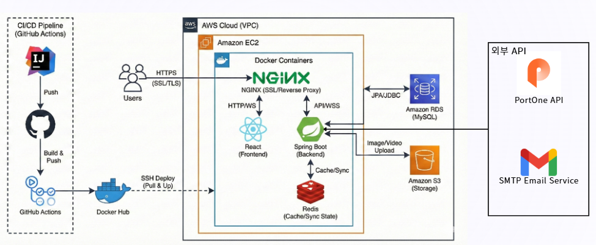

<h1>Joinflix (실시간 동기화 기반 OTT 소셜 파티 플랫폼)</h1>

## 📅 프로젝트 정보

- **진행 기간**: 2025.01.20 ~ 2025.02.28 (6주)
- **팀 구성**: 4명
- **핵심 타겟**: 영화 취향을 공유하고 함께 볼 사람을 찾는 사용자
- **주요 가치**: 실시간 상호작용 + 멤버십 기반 프리미엄 경험

---

# 🛠 기술 스택

## 🖥 Backend

     

## 🎨 Frontend

       

## ☁ DevOps & Infra

        

---

# 🌐 Production Deployment

- AWS EC2 기반 운영
- Docker Compose 컨테이너 환경
- Nginx Reverse Proxy
- Let's Encrypt SSL 적용
- HTTPS 전 구간 암호화

> 단순 개발 서버가 아닌, 실제 도메인 기반 운영 서비스입니다.

---

# 🔐 통합 인증 & 보안 설계

### ✔ 인증 구조

- AccessToken → 메모리 저장
- RefreshToken → HttpOnly + Secure 쿠키
- Refresh Token Rotation(RTR) 적용
- Redis 기반 토큰 관리
- Spring Security 필터 체인 커스터마이징

---

## 🔒 보안 제한 정책

| 구분        | 제한 항목          | 제한 수치  | 저장소 |
| ----------- | ------------------ | ---------- | ------ |
| 회원가입    | IP당 가입 제한     | 24시간 5회 | MySQL  |
| 이메일 인증 | 코드 유효시간      | 15분       | Redis  |
| 로그인      | 실패 시 잠금       | 1시간 5회  | MySQL  |
| 동시 접속   | 멤버십별 기기 제한 | 차등 적용  | Redis  |

---

## 🏗 Architecture

### 📌 Infrastructure Overview

- **AWS EC2 (Docker 기반 배포)**
- **Nginx Reverse Proxy (HTTPS / SSL)**
- **Spring Boot Backend**
- **React Frontend**
- **Redis (Cache & Sync State)**
- **Amazon RDS (MySQL)**
- **Amazon S3 (Image / Video Storage)**
- **GitHub Actions CI/CD 자동 배포**

### 📌 External APIs

- PortOne 결제 API
- SMTP Email Service

## 📺 Demo

### 🔐 인증 및 결제 프로세스

- JWT + RTR 기반의 안전한 로그인 및 PortOne API를 활용한 실시간 멤버십 결제 프로세스

### 🎉 실시간 파티방 & 채팅

- SSE 기반 친구 신청 및 파티방 초대 이벤트 알림
- WebSocket(STOMP) 기반 실시간 채팅과 영상 재생 동기화, WebRTC 음성 채팅이 통합된 파티룸 환경

---

# 👨‍💻 팀원 역할

## 🧑‍💻 강연주 (나의 역할) - Auth / Payment / DevOps

### 🔹 인증 & 보안

- **Spring Security** 필터 체인 커스터마이징 및 **JWT + RTR(Refresh Token Rotation)** 설계
- **OAuth 2.0 (Kakao)** 통합 인증 구현

### 🔹 동시성 및 세션 제어

- **Redis 기반 분산 세션 관리**: 멤버십별 최대 접속 기기 수 제한 로직 구현
- **FIFO 방식 Kick-out**: 초과 접속 시 가장 오래된 세션을 식별하여 우선 삭제하는 무결성 로직 설계

### 🔹 결제 시스템 및 인프라

- **PortOne API 연동**: 서버 측 사후 검증(Cross Validation)을 통한 금액 위변조 방지
- **Batch Scheduler**: 멤버십 만료 처리 및 자동 환불 보상 트랜잭션 로직 구현
- **CI/CD 파이프라인**: GitHub Actions와 Docker를 활용한 자동 배포 환경 구축 및 이미지 최적화

---

## 🧑‍💻 팀원 협업

- **김재우**: SSE 기반 실시간 친구 초대 알림 및 영화 리뷰/평점 시스템 개발
- **김유라**: React 기반 UI/UX 설계 및 WebRTC 기반 P2P 음성 채팅 시그널링 구현
- **최유림**: WebSocket(STOMP) 기반 1:N 채팅 및 서버 타임스탬프 기준 영상 동기화 로직 구현

---

# 🚀 Trouble Shooting

## 1️⃣ 외부 API와 로컬 DB 간 정합성 보장

> **Key Concepts:** DB-First Design, Transaction Integrity, Compensating Transaction, Transaction Propagation

### [문제] 환불 시 외부 API 성공 후 내부 로직 실패로 인한 데이터 불일치

- **원인:** 외부 API 호출이 DB 트랜잭션 내에 포함되어, 내부 오류로 롤백되어도 이미 완료된 외부 결제 취소를 되돌릴 수 없는 구조적 결함.
- **해결: DB-First 설계 및 트랜잭션 범위 최적화**
  1. **상태 우선 변경:** 내부 DB 상태를 '처리 중'으로 먼저 변경하여 로컬 트랜잭션의 무결성 확보.
  2. **순서 재설계:** 로컬 DB 커밋이 완전히 완료된 후 외부 API를 호출하도록 비즈니스 로직 순서 변경.
  3. **트랜잭션 분리:** `@Transactional(propagation = Propagation.REQUIRES_NEW)` 등을 활용하여 외부 API 지연이 핵심 DB 커넥션을 오래 점유하지 않도록 독립적인 트랜잭션으로 설계.
- **결과:** 외부 결제 상태와 내부 데이터 간 정합성 100% 확보 및 외부 API 지연으로 인한 커넥션 풀 고갈 예방.

## 2️⃣ 비동기 메일 발송 시 데이터 불일치

> **Key Concepts:** Transactional Event Listener, Async Processing, Event-Driven

### [문제] 파티 생성 실패 시에도 초대 이메일이 발송되어 존재하지 않는 파티에 초대되는 문제

- **원인:** `@Async`를 이용한 메일 발송 로직이 메인 트랜잭션(파티 생성)의 커밋 여부와 관계없이 즉시 실행됨.
- **해결: Transaction Event Listener 도입**
  - `@TransactionalEventListener(phase = TransactionPhase.AFTER_COMMIT)`를 적용하여, 메인 트랜잭션이 **최종 성공(Commit)**한 시점에만 비동기 로직이 트리거되도록 수정.
- **결과:** 불필요한 알림 리소스 낭비를 방지하고, 데이터 생성과 알림 서비스 간의 비즈니스 신뢰도 향상.

## 3️⃣ 동시 입장 시 데이터 경합 (Database Deadlock)

> **Key Concepts:** Pessimistic Lock, Deadlock Prevention, Race Condition

### [문제] 정원 4명인 파티에 5명 이상의 사용자가 동시에 입장할 때 Deadlock 발생 및 정원 초과

- **원인:** 조회 시점의 Shared Lock 경쟁과 수정 시점의 Exclusive Lock 전환 과정에서 트랜잭션 간 교착 상태(Error 1213) 발생.
- **해결: 비관적 락(Pessimistic Lock) 적용**
  - `@Lock(LockModeType.PESSIMISTIC_WRITE)`을 사용하여 엔티티 조회 시점부터 독점적 락을 획득, 트랜잭션 순차 처리를 강제함.
- **결과:** 데이터의 원자성을 보장하여 동시성 충돌을 해결하였으며, 트랜잭션 범위를 최소화하여 락 점유 시간을 단축함.

## 4️⃣ Redis 기반 동시 접속 및 기기 제한 로직 최적화

> **Key Concepts:** Redis Session Management, FIFO Kick-out, RTR(Refresh Token Rotation)

### [문제] 멤버십별 허용 기기 수 초과 시 세션 진입 간 충돌 및 정합성 문제

- **원인:** 분산 환경에서 다중 기기 접속 시 실시간 세션 카운팅이 어렵고, 초과 시 기존 세션을 만료시키는 우선순위 제어 로직 부재.
- **해결: Redis Hash 자료구조를 활용한 FIFO 세션 제어**
  1. **실시간 카운팅:** 세션 정보를 Redis Hash로 관리하여 인메모리 기반의 빠른 조회 및 TTL 관리 최적화.
  2. **FIFO 방식 적용:** 접속 허용 범위 초과 시 가장 오래된 토큰을 Redis에서 먼저 삭제(Kick-out)하는 대기열 로직 구현.
  3. **RTR 보안 적용:** 사용된 Refresh Token 재사용 감지 시 해당 사용자의 모든 세션을 즉각 무효화하여 보안성 강화.
- **결과:** 멤버십 정책에 따른 기기 제한 기능을 100% 구현하고, 세션 탈취 및 어뷰징 방지 체계 구축.

## 5️⃣ OSIV 비활성화 및 JPA N+1 문제 해결을 통한 성능 최적화

> **Key Concepts:** OSIV (Open Session In View) False, Connection Pool Management, Fetch Join, EntityGraph

### [문제] SSE 구독 및 페이지 이동 반복 시 커넥션 풀 고갈로 인한 서버 다운

- **원인:**
  1. **OSIV 활성화 상태의 부작용:** OSIV가 `true`일 경우 응답이 끝날 때까지 DB 커넥션을 점유함. SSE와 같은 장기 연결에서 커넥션이 반환되지 않고 고갈되는 현상 발생.
  2. **반복적인 JWT 검증 쿼리:** 매 요청마다 발생하는 사용자 조회 쿼리가 커넥션 고갈을 가속화함.
  3. **N+1 문제:** 지연 로딩 설정으로 인해 메인 엔티티 조회 후 연관 엔티티 수만큼 추가 쿼리가 발생하여 성능 저하.
- **해결: OSIV 비활성화 및 트랜잭션 내 데이터 로딩 완료**
  1. **OSIV 비활성화:** `open-in-view: false` 설정을 통해 트랜잭션 종료 시 즉시 커넥션을 반환하도록 최적화.
  2. **Fetch Join 및 EntityGraph:** 연관된 엔티티를 한 번의 쿼리로 가져오도록 최적화하여 쿼리 횟수 대폭 감소.
  3. **DTO Projection:** 서비스 레이어에서 엔티티를 DTO로 완전히 변환하여 컨트롤러로 반환함으로써 `LazyInitializationException` 원천 차단.
- **결과:** 시스템 안정성 확보 및 전체 쿼리 발생 횟수를 약 80% 이상 절감하여 로딩 속도 개선.

## 6️⃣ Docker Multi-stage 빌드를 통한 배포 효율성 개선

> **Key Concepts:** Multi-stage Build, Layer Caching, Image Light-weight

### [문제] Docker 이미지 크기 과다(500MB+) 및 빌드 시간 지연으로 인한 배포 성능 저하

- **원인:** 단일 스테이지 빌드 방식으로 인해 빌드 도구가 최종 이미지에 포함되어 용량이 비대해지고 배포 리소스 낭비 발생.
- **해결: 빌드 단계와 실행 단계의 분리**
  1. **Multi-stage 빌드:** 빌드 단계(Gradle)와 실행 단계(JRE)를 분리하여 실행 시점에 불필요한 도구 제거.
  2. **JRE 최적화:** JDK 대신 경량화된 JRE를 활용하여 최종 이미지 크기를 약 60% 축소(약 200MB).
  3. **GHA 캐싱:** GitHub Actions 빌드 시 의존성 레이어를 캐싱하여 반복 배포 시간 단축.
- **결과:** CI/CD 파이프라인 수행 시간을 2분 내외로 단축하고 운영 서버의 리소스 효율성 증대.

---

# 📊 핵심 성과 및 차별점

- **실무 수준 보안**: RTR(Refresh Token Rotation) 및 Redis 블랙리스트 기반 세션 무력화 구현
- **검증된 결제**: PortOne API 사후 검증 로직으로 금전적 위변조 시도 원천 차단
- **고성능 통신**: STOMP(텍스트)와 WebRTC(음성)를 결합한 하이브리드 실시간 환경 구축
- **실전 인프라**: AWS EC2/RDS 환경에서 1년 간의 실서비스 운영

---

# 🔮 Future Roadmap

- **Blue/Green 무중단 배포** 환경 고도화
- **Prometheus + Grafana**를 활용한 실시간 리소스 모니터링 대시보드 구축
- **Kafka** 기반의 이벤트 기반 아키텍처(EDA) 확장으로 서비스 간 결합도 완화
